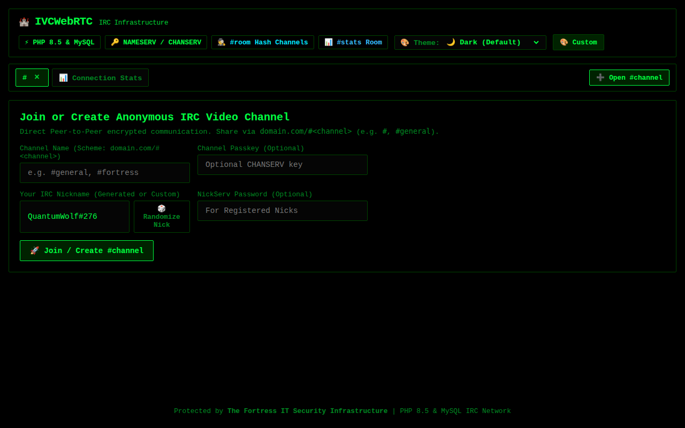
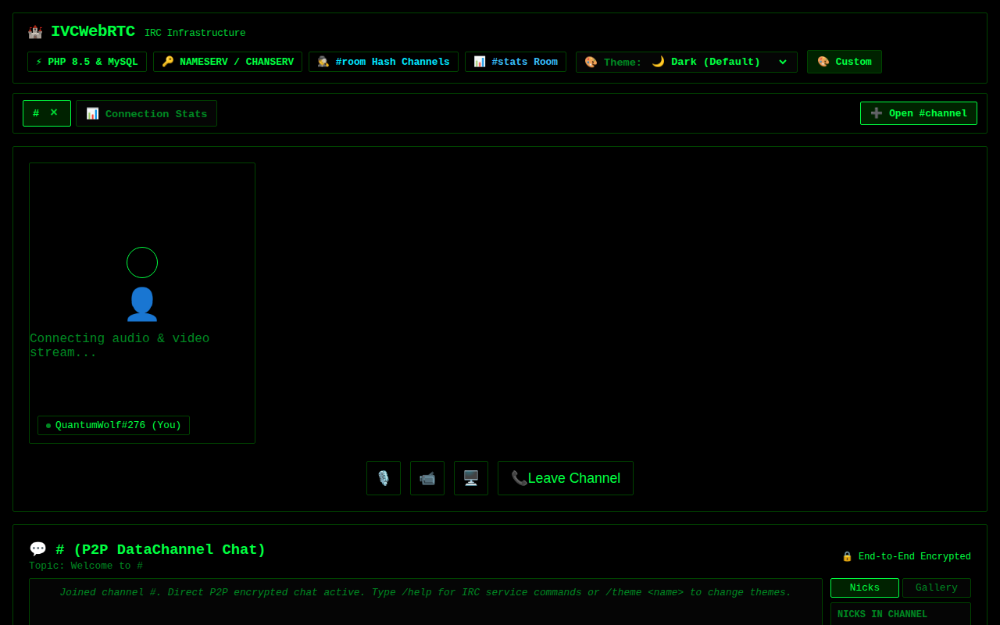

# Internet Video Chat (IVC) — WebRTC Anonymous & Encrypted Chat

[](https://www.php.net)
[](docs/FORTRESS-GUIDE.md)
[](LICENSE)

**IVC WebRTC** is a lightweight, zero-retention, peer-to-peer (P2P) anonymous video and text chat application powered by **PHP** and **WebRTC**. Built on top of **The Fortress IT Security Infrastructure**, IVC provides real-time encrypted video streams and end-to-end encrypted data channels directly between browsers without storing messages, media streams, or user metadata on any server.

---

## 📸 Interface Screenshots

### Anonymous Room Lobby
Create or join a room using custom or randomly generated identities with optional room lock passkeys:


### Encrypted Video Stage & P2P Data Channel Chat
Direct P2P WebRTC media streaming and end-to-end encrypted chat with real-time room sharing link:


---

## ✨ Key Features

- 🔒 **End-to-End Encrypted (E2EE)**: Direct peer-to-peer WebRTC video, audio, screen sharing, and DataChannel messaging.
- 🕵️ **Zero Retention & Non-Logging**: Ephemeral signaling messages are held only in RAM until delivered and immediately purged.
- 🔗 **Simplified URL Routing**: Direct room joining via `domain.com/<room-id>` or `domain.com/?room=<room-id>`.
- 🔑 **Optional Room Passkeys**: Lock rooms with passphrase protection for private communication.
- ⚡ **Realtime SSE & Poll Modes**: Supports Server-Sent Events (SSE) for low-latency signaling fallback.
- 🛡️ **Fortress IT Security Framework**:
  - Strict Content Security Policy (CSP), HSTS, and X-Frame-Options headers.
  - Ephemeral client key rate limiting.
  - Input sanitization and payload validation.
  - CSRF protection for signaling actions.

---

## 🚀 Installation & Hosting Deployment Guide

### Prerequisites
- **PHP**: 8.1 or higher (PHP 8.3/8.5 recommended) with `OpenSSL` extension enabled.
- **Web Server**: Apache (`mod_rewrite` enabled), Nginx, or LiteSpeed.
- **SSL Certificate**: **HTTPS is required** by modern browsers for WebRTC camera and microphone access (e.g. via Let's Encrypt / cPanel AutoSSL).

---

### Option A: Standard Apache / cPanel / Shared Hosting

1. **Upload Files**: Upload the project directory to your host (e.g., `public_html/` or a subfolder).
2. **Set Web Root**: Point your domain/subdomain document root to the `public/` directory.
3. **Configure `.htaccess`**: Create a `.htaccess` file inside `public/` to handle clean room URLs (`domain.com/<room-id>`):

   ```apache
   <IfModule mod_rewrite.c>
       RewriteEngine On
       RewriteCond %{REQUEST_FILENAME} !-f
       RewriteCond %{REQUEST_FILENAME} !-d
       RewriteRule ^ index.php [L]
   </IfModule>
   ```

4. **Verify HTTPS**: Ensure SSL is active. Open `https://yourdomain.com` in your browser.

---

### Option B: Nginx Web Server

Add the following location configuration block to your Nginx server block:

```nginx
server {
    listen 443 ssl http2;
    server_name chat.yourdomain.com;

    root /var/www/ivc/public;
    index index.php;

    # Security Headers provided by PHP Fortress layer, but can also be enforced here
    add_header X-Content-Type-Options "nosniff" always;
    add_header X-Frame-Options "DENY" always;

    location / {
        try_files $uri $uri/ /index.php?$query_string;
    }

    location ~ \.php$ {
        include fastcgi_params;
        fastcgi_pass unix:/run/php/php8.3-fpm.sock;
        fastcgi_param SCRIPT_FILENAME $document_root$fastcgi_script_name;

        # Buffer settings for Realtime SSE streaming
        fastcgi_buffering off;
        fastcgi_read_timeout 60s;
    }
}
```

---

### Option C: Quick Local Development

Run the built-in PHP development web server locally:

```bash
php -S 127.0.0.1:8080 -t public
```

Open `http://127.0.0.1:8080` in your web browser.

---

## 📡 API Documentation

The IVC Signaling API manages ephemeral WebRTC negotiation (offers, answers, ICE candidates, and room state). All endpoints are located at `/api/signal.php`.

### Base Endpoint
`GET /api/signal.php` | `POST /api/signal.php`

---

### 1. Poll Room Signaling & Messages (GET)

Fetches active peer list and pending WebRTC signaling messages for a client in a room.

#### Query Parameters
| Parameter | Type | Required | Description |
| :--- | :--- | :--- | :--- |
| `room` | `string` | **Yes** | Sanitized room identifier (alphanumeric, max 64 chars). |
| `client` | `string` | **Yes** | Unique client identifier. |
| `mode` | `string` | No | Set to `sse` for Server-Sent Events streaming; default is standard HTTP poll. |

#### Request Example
```http
GET /api/signal.php?room=fortress-room&client=peer-abc-123 HTTP/1.1
Host: chat.yourdomain.com
```

#### Response (`200 OK`)
```json
{
  "status": "ok",
  "peers": [
    "peer-xyz-789"
  ],
  "messages": [
    {
      "from": "peer-xyz-789",
      "type": "offer",
      "sdp": {
        "type": "offer",
        "sdp": "v=0\r\no=- 123456789..."
      },
      "timestamp": 1718000000
    }
  ],
  "csrf_token": "a1b2c3d4e5f6..."
}
```

---

### 2. Stream Realtime Signals via SSE (GET)

Opens an EventStream connection to receive instant WebRTC signaling events without polling.

#### Query Parameters
| Parameter | Type | Required | Description |
| :--- | :--- | :--- | :--- |
| `room` | `string` | **Yes** | Target room ID. |
| `client` | `string` | **Yes** | Client ID. |
| `mode` | `string` | **Yes** | Must be `sse`. |

#### Request Example
```http
GET /api/signal.php?room=fortress-room&client=peer-abc-123&mode=sse HTTP/1.1
Accept: text/event-stream
```

#### SSE Stream Output
```text
data: {"from":"peer-xyz-789","type":"peer-joined","timestamp":1718000000}

data: {"from":"peer-xyz-789","type":"offer","sdp":{...},"timestamp":1718000001}

: keepalive
```

---

### 3. Send WebRTC Signal / Leave Room (POST)

Broadcasts SDP offers, SDP answers, ICE candidates, or explicit room disconnect notifications.

#### Headers
`Content-Type: application/json`

#### Body Parameters
| Parameter | Type | Required | Description |
| :--- | :--- | :--- | :--- |
| `room` | `string` | **Yes** | Room name/ID. |
| `client` | `string` | **Yes** | Sending client ID. |
| `type` | `string` | **Yes** | Signal type: `offer`, `answer`, `candidate`, `join`, `leave`, `ping`. |
| `sdp` | `object/string` | Conditional | WebRTC Session Description Protocol object (for `offer`/`answer`). |
| `candidate` | `object` | Conditional | WebRTC ICE Candidate object (for `candidate`). |

#### Request Example: Send Offer
```http
POST /api/signal.php HTTP/1.1
Content-Type: application/json

{
  "room": "fortress-room",
  "client": "peer-abc-123",
  "type": "offer",
  "sdp": {
    "type": "offer",
    "sdp": "v=0\r\no=- 987654321..."
  }
}
```

#### Response (`200 OK`)
```json
{
  "status": "sent"
}
```

#### Request Example: Leave Room
```http
POST /api/signal.php HTTP/1.1
Content-Type: application/json

{
  "room": "fortress-room",
  "client": "peer-abc-123",
  "type": "leave"
}
```

#### Response (`200 OK`)
```json
{
  "status": "left"
}
```

---

### Error Responses

- **`400 Bad Request`**: Missing required parameters or malformed JSON payload.
  ```json
  { "error": "Room ID and Client ID required" }
  ```
- **`429 Too Many Requests`**: Rate limit exceeded (default 120 requests/minute).
  ```json
  { "error": "Rate limit exceeded. Please wait." }
  ```
- **`405 Method Not Allowed`**: Unsupported HTTP verb.
  ```json
  { "error": "Method Not Allowed" }
  ```

---

### 4. Foreign Services API (`/api/services.php`)

Allows registering, querying, pinging, and executing commands on foreign services operating under different hosts.

#### List Foreign Services (GET)
```http
GET /api/services.php?action=list HTTP/1.1
Host: chat.yourdomain.com
```

#### Register Foreign Service (POST)
```http
POST /api/services.php HTTP/1.1
Content-Type: application/json

{
  "action": "register",
  "service_name": "HELPBOT",
  "host": "help.external-domain.org",
  "api_endpoint": "https://help.external-domain.org/api/irc",
  "metadata": "External AI Help Service"
}
```

#### Dispatch Command to Foreign Service (POST)
```http
POST /api/services.php HTTP/1.1
Content-Type: application/json

{
  "action": "execute",
  "service_name": "HELPBOT",
  "sender": "CyberFox",
  "command": "SEARCH WebRTC encryption"
}
```

---

## 🤖 IRC System Bots & Services Directory

IVC includes a full IRC Services suite operating natively and supporting foreign services:

| Bot / Service | Function | Key Commands |
| :--- | :--- | :--- |
| **`NAMESERV`** | Nickname Registration & Authentication | `/msg NAMESERV REGISTER <pass> [email]`, `/msg NAMESERV IDENTIFY <pass>` |
| **`CHANSERV`** | Channel Registration, Topic & OPs | `/msg CHANSERV REGISTER <#chan>`, `/msg CHANSERV OP <#chan> <nick>`, `/topic <new_topic>` |
| **`MOTDSERV`** | Serverwide Message of the Day | `/msg MOTDSERV SET <new_motd>`, `/motd` |
| **`MEMOSERV`** | Offline Messaging & Memo Storage | `/msg MEMOSERV SEND <nick> <msg>`, `/msg MEMOSERV READ [num]`, `/memo` |
| **`HOSTSERV`** | User Virtual Host (VHost) Management | `/msg HOSTSERV REQUEST <vhost>`, `/msg HOSTSERV ON`, `/vhost` |
| **`SERVICESERV`** | Network & Foreign Services Directory | `/msg SERVICESERV LIST`, `/msg SERVICESERV REGISTER <name> <host> <endpoint>` |

---

## 🧪 Testing

Execute the automated backend test suite:

```bash
php tests/WebRtcSiteTest.php
```

All 49 security, signaling, IRC bot, and foreign service assertions should pass.

---

## 🛡️ Security Architecture & Compliance

IVC is integrated with **The Fortress IT Security Infrastructure**:
- **Security Headers**: CSP, HSTS, X-Frame-Options: DENY, Referrer-Policy: no-referrer, Permissions-Policy for WebRTC media constraints.
- **Sanitization**: Strict character whitelist filtering on room names and client identifiers to eliminate XSS/Injection vectors.
- **Ephemeral State**: In-memory signaling array reset and immediate queue purge upon delivery (Zero Disk Footprint).

---

## 📜 License

Distributed under the **MIT License**. See [`LICENSE`](LICENSE) for details.
